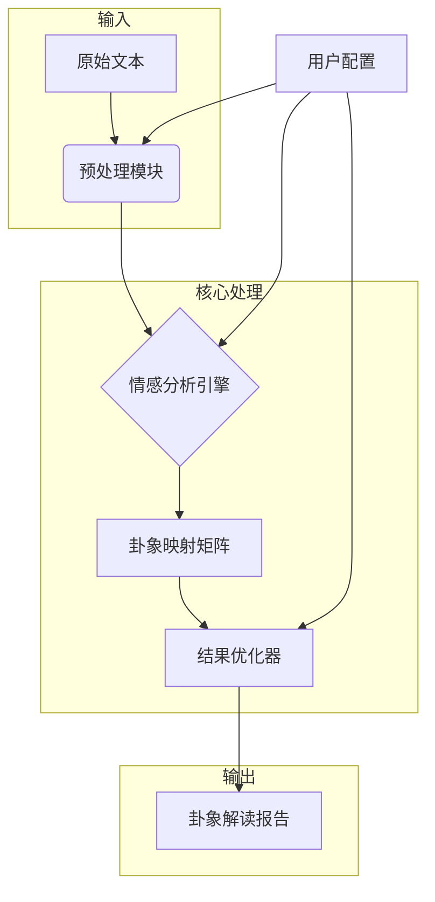

## 系统架构与数据流程


## 输入输出示例
### 输入样例
```text
今日市场波动剧烈，投资者情绪复杂交织，既有对政策利好的期待，也有对不确定性的担忧。
```

### 输出样例
```json
{
  "卦象": "坎为水（䷜）",
  "关键词": ["险陷", "困境", "挑战"],
  "解读": "当前形势如同水流险陷，建议保持谨慎..."
}
```

## 运行说明
1. 安装依赖：`pip install -r requirements.txt`
2. 准备输入文本文件
3. 执行主程序：`python src/main.py -i input.txt -o output.json`